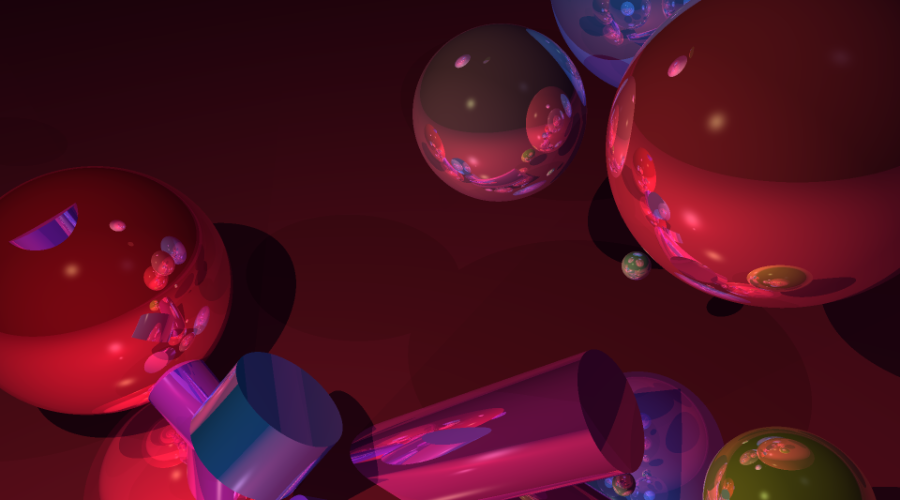
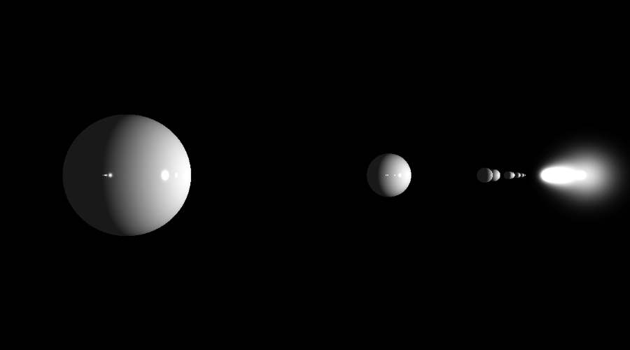
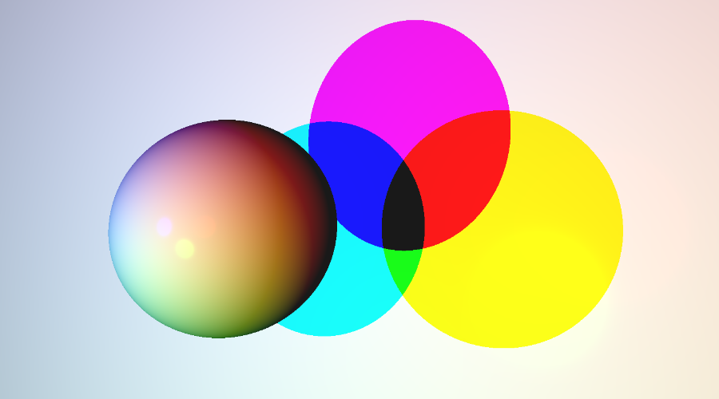
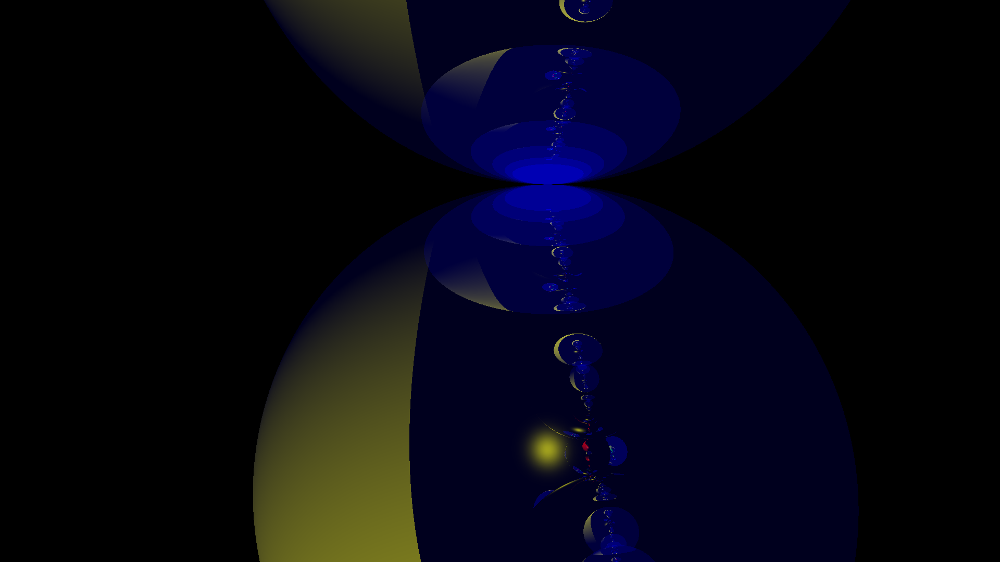
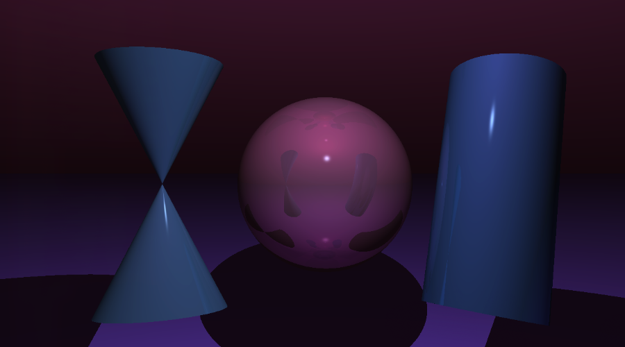

# MiniRT - A Simplified Raytracer in C

## Overview

**MiniRT** is a basic Raytracer developed as part of the 42 curriculum. The goal was to render 3D scenes by simulating the physical behavior of light. It calculates the path of light rays, their intersections with geometric objects, and the resulting shadows and lighting effects using the Phong reflection model.

Built from scratch in C, this project utilizes the MiniLibX graphical library to handle window management and pixel rendering.

Speaking of pixels, each one's color is calculated one at a time, which corresponds to 2,073,600 pixels for 1080p. This is the ultimate project for every fan of micro-optimization, just like we are.

A more detailed presentation is available at https://avdplassche.ch/projects/minirt.html

---

## Features

### Basic

- **Geometric Primitives**: Support for spheres, planes, cylinders and cones.

- **Lighting System**:
    - Ambient lighting.
    - Diffuse and Specular reflections.
    - Hard shadows.
    - Multiple light sources.

- **Camera System**: Adjustable Field of View (FOV), position, and orientation.

- **Scene Parsing**: Reads and validates `.rt` configuration files.

### Bonus

- **Multithreaded** render

- **Recursive reflections** (mirror effect)

- **Interactive Hooks**:
	- Camera movements (WASD / Arrows)
	- Change shapes attributes (Numpad)
	- Extra debug and UX features (scene saver, font colors, info display, ...)

---

## Gallery

